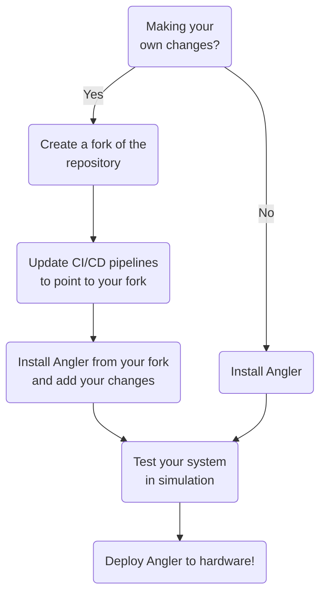

import UVMS from "@site/src/components/UVMS";
import BlueROV2HeavyAlpha from "@site/static/img/vehicles/bluerov2_heavy_alpha.png";

# Overview

Angler is an autonomy framework implemented using ROS 2 that is designed to
support development, testing, and sim-to-real deployment of lightweight
underwater vehicle manipulator systems (UVMS). This is accomplished through the
following features:

1. **Custom whole-body controllers**: Angler supports the development and
   integration of custom whole-body UVMS controllers using [angler_control](https://github.com/Robotic-Decision-Making-Lab/angler/tree/main/angler_control).
2. **High-level autonomy with behavior trees**: High-level autonomy capabilities
   needed to perform complex intervention tasks are supported using behavior
   trees. Angler implements several primitive behaviors from which more complex
   intervention behaviors can be constructed using [angler_behaviors](https://github.com/Robotic-Decision-Making-Lab/angler/tree/main/angler_behaviors).
3. **Localization and vehicle control**: Angler supports system localization
   and vehicle-specific integration using its sibling project, [Blue](https://robotic-decision-making-lab.github.io/blue/).
4. **Simulation using Gazebo**: Vehicle models and configurations have been
   created for Gazebo.
5. **CI/CD pipelines**: Angler implements CI/CD pipelines to help you deploy your
   software in the same environment that you performed development and testing
   in. Docker images are built for the `amd64` and `arm64` CPU architectures so
   that you can easily deploy your software to a variety of hardware platforms.
6. **Development environment**: Angler provides a development environment that
   includes all of the tools you need to develop software for UVMS, such as
   ROS 2, Gazebo, linters, and formatters. This helps you avoid spending
   resources setting up your development environment and focus on writing your
   robotics algorithms 😀

## Recommended workflow

Angler is designed to be flexible and modular, enabling you to make changes
according to the needs of your project. However, our commitment to flexibility
does not compromise our effort to ensure that the provided system caters to
a wide range of use cases. With this in mind, we recommend the following
workflow for using Angler:

## Supported Systems

Angler has been integrated and tested on the following systems:

  <UVMS name="BlueROV2 Heavy Alpha" img={BlueROV2HeavyAlpha}>
    The BlueROV2 Heavy Alpha modifies the [Blue
    Robotics](https://bluerobotics.com/) BlueROV2 Heavy by moving the thrusters
    located on the upper chassis to the lower chassis. This modification
    facilitates the integration of a [Reach
    Robotics](https://reachrobotics.com/) Reach Alpha 5 manipulator, a popular
    lightweight 5 degree-of-freedom manipulator. This configuration was first
    proposed by [Reach Robotics](https://reachrobotics.com/) to enable
    intervention tasks.
  </UVMS>

